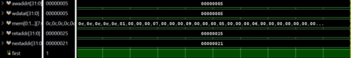

# AXI_memory
Design and verification of AXI Memory

**Project Report On Design and Verification of AXI4 Memory**  

**Submitted in Partial Fulfillment for the award of Post Graduate Diploma in VLSI Design (PG-DVLSI)** 

from 

**C-DAC, ACTS (Pune)** 

**Authors:** 

**Mr. Lalith Phani Kumar Perni Mr. Sudhagona Suprith Goud Mr. Utkarsh Kushwaha** 

**Centre for Development of Advanced Computing (C-DAC), Pune**

![ref1]

**TABLE OF CONTENTS** 

**1. Introduction** 

1. Introduction 
1. Literature Survey 
1. Aim of Project 
1. Scope and Objective 

**2. THEORETICAL DESCRIPTION OF PROJECT** 

1. Introduction to AMBA 
1. Features of AXI4 
1. Channel Handshake 
1. AXI4 Channels 
1. Channel Transfer Example 
1. Data size, Length and Burst type 

**3. SYSTEM DESIGN AND OPTIMIZATION** 

1. Design Information 
1. Basic Block Diagram 

3\.Implementation Considerations 

**5. RESULTS AND TOOLS USED** 

1. Simulation Result 
1. Synthesis Result 
1. Xilinx Vivado and Questa Sim 

**6. VERIFICATION** 

**1.** Verification Technology – UVM 

7. **CONCLUSION** 
7. **FUTURE SCOPE** 
7. **REFERENCES** 

**Abstract**

In modern digital systems, the efficient and reliable transfer of data between processing elements and memory subsystems is crucial for achieving high performance. The AXI4 (Advanced eXtensible Interface 4) protocol has emerged as a standard for interconnecting components  within  System-on-Chip  (SoC)  designs,  offering  a  flexible  and  scalable solution  for  memory  access.  This  abstract  presents  a  comprehensive  approach  to  the design  and  verification  of  a  high-performance  AXI4  memory  interface,  ensuring robustness, efficiency, and compatibility within complex system architectures. 

The design phase encompasses several critical stages, including architecture definition, protocol  selection  and  interface  configuration  for  designing  AXI4  master  and  slave interfacing  with  memory.  The  memory  interface  architecture  is  tailored  to  meet  the stringent requirements of modern computing systems. 

Verification  of  the  AXI4  memory  interface  involves  exhaustive  testing  to  ensure functional  correctness,  protocol  compliance,  and  interoperability  with  diverse  system components.  Utilizing  industry-standard  verification  methodologies  such  as  UVM (Universal  Verification  Methodology)  and  formal  verification  techniques,  the  design undergoes rigorous validation across various scenarios and corner cases. 

The  proposed  design  and  verification  methodology  yield  a  high-performance  AXI4 memory  interface  capable  of  seamlessly  integrating  into  complex  SoC  designs  while meeting the demands of modern computing applications. By leveraging a combination of advanced  design  techniques  and  rigorous  verification  methodologies,  the  memory interface architecture achieves optimal performance, reliability, and scalability, thereby facilitating the development of next-generation computing systems. 

Keywords: AXI4, Memory Interface, Design, Verification, UVM. 

**INTRODUCTION ![ref1]**

In  the  realm  of  modern  computing  systems,  the  quest  for  high-performance  memory interfaces stands as a crucial frontier. With the relentless pursuit of faster data processing and  seamless  interaction  between  various  components,  the  demand  for  efficient  and reliable memory interfaces has escalated. Among the plethora of protocols available, the Advanced  eXtensible  Interface  4  (AXI4)  emerges  as  a  cornerstone,  offering  a  robust framework for connecting components within a system-on-chip (SoC) architecture. 

This  document  delves  into  the  intricate  world  of  designing  and  verifying  high- performance AXI4 memory interfaces. It embarks on a journey through the fundamental principles,  design  methodologies,  challenges,  and  verification  strategies  essential  for crafting robust and efficient AXI4 memory interfaces. 

Fundamentals of AXI4 Protocol Here, we provide a comprehensive overview of the AXI4 protocol,  elucidating  its  key  features,  transaction  types,  signaling  mechanisms,  and protocol layers. Understanding the intricacies of AXI4 forms the bedrock for designing efficient memory interfaces that harness its full potential. 

Design Considerations This section navigates through the crucial design considerations when  architecting  high-performance  AXI4  memory  interfaces.  From  optimizing  data throughput  and  minimizing  latency  to  ensuring  compatibility  with  diverse  memory devices, each aspect is meticulously examined to unveil the underlying principles guiding optimal design decisions. 

Implementation Strategies Armed with a profound understanding of AXI4 fundamentals and design considerations, this section delves into implementation strategies tailored to unleash the full performance potential of AXI4 memory interfaces. From pipelining and parallelism to advanced arbitration techniques, a myriad of strategies are explored to craft interfaces that seamlessly integrate with the broader SoC ecosystem. 

Verification  Methodologies  The  reliability  and  correctness  of  high-performance  AXI4 memory  interfaces  hinge  on  robust  verification  methodologies.  In  this  section,  we elucidate  various  verification  strategies,  including  simulation-based  testing,  formal verification, and hardware emulation, essential for rigorously validating the functionality and performance of AXI4 memory interfaces across diverse usage scenarios. 

![ref1]

**LITERATURE SURVEY** 

The Advanced Microcontroller Bus Architecture (AMBA) is an open-standard, on-chip interconnect specification for the connection and management of functional blocks in system-on-a-chip  (SoC)  designs.  The  literature  on  AXI4  Memory  Interface  enclose diverse perspectives, addressing performance optimization, security considerations, and adaptability in various computing environments. 

**Performance Optimization:** 

Research  often  delves  into  enhancing  AXI4  Memory  Interface  performance.  Studies explore  methods  to  boost  data  transfer  rates,  minimize  latency,  and  optimize  overall system efficiency. Novel techniques, such as parallel processing and advanced buffering strategies,  are  proposed  to  achieve  high-throughput  and  low-latency  communication within the AXI4 framework. 

**Energy Efficiency in AXI4:** 

With a growing focus on energy-aware computing, researchers investigate strategies for energy-efficient  AXI4  Memory  Interface  access.  This  involves  the  development  of power-saving mechanisms and trade-offs to balance performance requirements with the stringent power constraints of devices, particularly in the context of Internet of Things (IoT) applications. 

**Security Challenges:** 

Security  considerations  in  AXI4-based  memory  systems  are  a  critical  area  of  study. Papers examine potential vulnerabilities and propose countermeasures to ensure secure data transfers. Topics include access control mechanisms, data integrity verification, and protection  against  unauthorized  access,  contributing  insights  into  safeguarding  AXI4 Memory Interfaces from security threats 

**Scalability in Multi-Core Architectures:** 

As multi-core processors become prevalent, research addresses scalability challenges in AXI4  interconnects.  Investigations  focus  on  identifying  and  mitigating  bottlenecks  to accommodate  increasing  core  counts.  Proposed  scalable  AXI4  Memory  Interface architectures  aim  to  optimize  memory  access  in  the  context  of  evolving  multi-core 

systems, balancing performance and scalability ![ref1]**Adaptive AXI4 Interfaces:** 

Adaptive  AXI4  Memory  Interface  designs  are  explored  for  heterogeneous  computing platforms. Researchers investigate dynamic adjustments to memory access patterns based on  varying  workloads,  optimizing  resource  utilization.  This  adaptability  is  crucial  in environments with diverse computing tasks, showcasing the flexibility of AXI4 interfaces in meeting the demands of heterogeneous computing. 

**Real-time Monitoring and Fault Tolerance:** 

Some studies introduce real-time monitoring systems for AXI4 transactions to enhance system reliability. Additionally, research addresses fault-tolerant AXI4 Memory Interface designs, particularly for critical applications like aerospace systems. These mechanisms aim  to  detect  and  mitigate  memory  errors  induced  by  environmental  conditions  or radiation, ensuring data integrity and system reliability in challenging contexts. 

**Machine Learning Integration:** 

Emerging research explores the integration of machine learning techniques to optimize AXI4  Memory  Interfaces.  This  involves  developing  models  that  learn  and  adapt  to application-specific access patterns, dynamically adjusting interface parameters. Machine learning-driven optimizations aim to enhance overall system performance by predicting and responding to the varying demands of different workloads efficiently. 

**Cross-Layer Analysis in Cyber-Physical Systems (CPS):** 

Some studies conduct cross-layer analyses of AXI4 interconnects within the context of cyber-physical  systems  (CPS).  This  approach  examines  the  interactions  between hardware  and  software  layers,  identifying  challenges  and  opportunities  for  improving AXI4 Memory Interface design within CPS architectures. The research contributes to a holistic  understanding  of  system  performance,  essential  for  the  integration  of  AXI4 interfaces in CPS applications. 

**Mobile Device Considerations:** 

Tailoring  AXI4  Memory  Interface  design  to  mobile  devices  is  a  specific  focus  area. Research explores power-aware optimization strategies, dynamically adjusting interface parameters based on the device's power state. The goal is to achieve energy-efficient 

AXI4  Memory  Interfaces  without  compromising  performance,  addressing  the  unique power constraints of mobile computing platforms. ![ref1]

**Application in Automotive Electronics:** 

Another niche area of investigation involves the application of AXI4 Memory Interfaces in automotive electronics. Research in this domain explores the specific requirements and challenges  in  integrating  AXI4  interfaces  for  efficient  data  communication  within automotive systems. This includes considerations for real-time data transfer, reliability, and  safety-critical  functionalities  in  the  context  of  modern  automotive  electronics architectures. 

![ref1]

**AIM OF PROJECT** 

The project aims to design and verify AXI4 memory interface of having variable data and address width with three burst types of fixed mode, increment mode and wrap mode. 

The top module has instance of slave of AXI4 written in system Verilog. The design is verified using UVM. By doing so, it will demonstrate correctness of the writing data in memory array with AXI4 slave as per instructed by master. Verification has checks that helps in checking of functionality of the design and if present, indicates the violations in design according to AXI4 protocol. 

The  primary  aim  of  implementing  a  AXI4  memory  interface  is  to  understand  AXI4 protocol and design and observe the read and write operation of from AXI4 master to AXI4 slave into the memory. 

**SCOPE AND OBJECTIVE** 

- RTL design of AXI4 Slave 
- Integrating  AXI4  Master  and  Slave  to  perform  write  in  and  read  from  memory  in  fixed, increment mode and wrap mode following proper handshake as per the AXI protocol. 
- Verification of AXI4 design using UVM involving list of monitor checks for analyzing protocol violations. 

The  scope  of  the  AXI4  memory  interface  is  broad,  encompassing  various  aspects  of  system-level communication and memory access within digital systems,  key dimensions that define the scope of AXI4: 

**Interconnect Standard:** 

AXI4 serves as a widely adopted interconnect standard in System-on-Chip (SoC) designs. Its scope includes facilitating communication and data transfer between different IP (Intellectual Property) blocks, processors, memories, and peripherals within an integrated circuit. 

**High Performance and Scalability:** 

AXI4 is designed to meet the requirements of high-performance systems. Its scope extends to providing a scalable and efficient communication interface, enabling seamless integration of components in complex SoCs. The interface supports multiple channels, allowing for parallel transactions and increased   

**Flexibility and Adaptability:** 

The scope of AXI4 includes flexibility and adaptability, allowing designers to tailor the interface to specific application needs. Parameters such as data width, burst lengths, and transaction types can be configured to optimize performance based on the requirements of the connected components. 

**Memory-Mapped Communication:** 

AXI4 is commonly used for memory-mapped communication, enabling efficient access to memory- mapped  registers  and  memory  spaces.  The  scope  includes  providing  a  standardized  method  for processors and peripherals to interact with memory-mapped locations in a coherent and efficient manner. 

**Cross-Platform Integration:** 

AXI4's scope extends beyond individual chip designs to facilitate cross-platform integration. It is widely utilized  in  FPGA  (Field-Programmable  Gate  Array)  implementations,  allowing  for  seamless 

communication between different programmable logic components and processors. ![ref1]

**Security Considerations:** 

In modern digital systems, the scope of AXI4 encompasses security  considerations. Researchers and engineers explore methods to enhance the security of AXI4-based systems, including access control mechanisms, data integrity verification, and protection against potential vulnerabilities. 

**Application in Various Domains:** 

AXI4  finds  application  in  diverse  domains,  ranging  from  consumer  electronics  to  automotive  and aerospace  systems.  Its  scope  includes  addressing  the  communication  needs  of  a  wide  array  of applications, emphasizing its versatility and relevance across different industries 

Therefore the scope of  AXI4 is comprehensive, covering interconnectivity, performance, scalability, adaptability, memory-mapped communication, cross-platform integration, security, and application in various domains. Its widespread adoption in the industry underscores its significance in modern digital system design. 

![ref1]

**THEORETICAL DESCRIPTION OF PROJECT** 

1. **Introduction to AMBA** 

The Advanced microcontroller bus architecture (AMBA) family enables extensive testing of intellectual property (IPs) such as from ARM and other IP suppliers and system-on-chip (SoC) design through metric-driven protocol compliance verification. It delivers high- frequency operation using sophisticated bridges and supports tremendous performance and high-frequency. It is appropriate for high-bandwidth and low latency designs. The Advanced eXtensible Interface 4 (AXI4) bus family, defined as part of the ARM - AMBA standard's fourth version. The AMBA – AXI4-lite bus protocol is a subset of the AXI4 bus protocol with a simpler interface than the full-featured AXI-4 bus protocol. It only supports one ID thread per master, therefore it's best for an endpoint that only has to connect with one master at a time. There are five channels in the AXI4-Lite interface: read data, read address, write data, write address, and write response. Burst lengths up to 256 bits are supported by the AXI4 family. 

The AXI protocol is burst-based. Every transaction has address and control information on the address channel that describes the nature of the data to be transferred. The data is transferred between master and slave using a write data channel to the slave or a read data channel to the master. In write transactions, in which all the data flows from the master to the slave, the AXI protocol has an additional write response channel to allow the slave to signal to the master the completion of the write transaction. 

The objectives of the latest generation AMBA interface are to: 

- be suitable for high-bandwidth and low-latency designs 
- enable high-frequency operation without using complex bridges 
- meet the interface requirements of a wide range of components 
- be suitable for memory controllers with high initial access latency 
- provide flexibility in the implementation of interconnect architectures 
- be backward-compatible with existing AHB and APB interfaces. 

The key features of the AXI protocol are: 

- separate address/control and data phases 
- support for unaligned data transfers using byte strobes 
- burst-based transactions with only start address issued 
- separate read and write data channels to enable low-cost Direct Memory Access (DMA) 
- ability to issue multiple outstanding addresses 
- out-of-order transaction completion 
- easy addition of register stages to provide timing closure. 
2. **Features of AXI** 

The AXI protocol has several key features that are designed to improve bandwidth and latency of data transfers and transactions, as you can see here: 

**Independent read and write channels** 

AXI  supports  two  different  sets  of  channels,  one  for  write  operations,  and  one  for  read operations.  Having  two  independent  sets  of  channel  helps  to  improve  the  bandwidth performances of the interfaces. This is because read and write operations can happen at the same time. 

**Multiple outstanding addresses** 

AXI allows for multiple outstanding addresses. This means that a master can issue transactions without  waiting  for earlier  transactions  to  complete.  This can improve  system  performance because it enables parallel processing of transactions. 

**No strict timing relationship between address and data operations** 

With AXI, there is no strict timing relationship between the address and data operations. This means that, for example, a master could issue a write address on the **Write Address** channel, but there is no time requirement for when the master has to provide the corresponding data to write on the **Write Data** channel. 

**Support for unaligned data transfers** 

For any burst that is made up of data transfers wider than one byte, the first bytes accessed can be unaligned with the natural address boundary. For example, a 32-bit data packet that starts at a byte address of 0x1002 is not aligned to the natural 32-bit address boundary. 

**Out-of-order transaction completion** 

Out-of-order  transaction  completion  is  possible  with  AXI.  The  AXI  protocol  includes transaction identifiers, and there is no restriction on the completion of transactions with different ID values. 

This means that a single physical port can support out-of-order transactions by acting as several logical ports, each of which handles its transactions in order. 

**Burst transactions based on start address** 

AXI masters only issue the starting address for the first transfer. For any following transfers, the 

slave will calculate the next transfer address based on the burst type. 

3. **Channel Handshake** 

**Handshake process** 

All  five  channels  use  the  same  VALID/READY  handshake  to  transfer  data  and  control information. This two-way flow control mechanism enables both the master and slave to control the rate at which the data and control information moves. The source generates the VALID signal to indicate when the data or control information is available. The destination generates the READY signal to indicate that it accepts the data or control information. Transfer occurs only when both the VALID and READY 

signals are HIGH. 

There must be no combinatorial paths between input and output signals on both master and slave interfaces.  

Figure 1 to Figure 3 show examples of the handshake sequence. In Figure 1, the source presents the  data  or  control  information  and  drives  the  VALID  signal  HIGH.  The  data  or  control information  from  the  source  remains  stable  until  the  destination  drives  the  READY  signal HIGH, indicating that it accepts the data or control information. The arrow shows when the transfer occurs. 

Figure 1 - WVALID before AWREADY handshake 

In Figure 2  the destination drives READY HIGH before the data or 

control information is valid. This indicates that the destination can accept the data or control information in a single cycle as soon as it becomes valid. The arrow shows when the transfer occurs. 

Figure 2 AWREADY before AWAVALID handshake 

In Figure 3, both the source and destination happen to indicate in the same cycle that they can transfer the data or control information. In this case the transfer occurs immediately. The arrow shows when the transfer occurs. ![ref1]

Figure 3  AWVALID with AWREADY handshake 

The individual AXI protocol channel handshake mechanisms are described in: 

- Write address channel 
- Write data channel 
- Write response channel 
- Read address channel 
- Read data channel 

**Write address channel** 

The master can assert the AWVALID signal only when it drives valid address and control information. It must remain asserted until the slave accepts the address and control information and asserts the associated AWREADY signal. 

The default value of AWREADY can be either HIGH or LOW. The recommended default value is HIGH, although if AWREADY is HIGH then the slave must be able to accept any valid address that is presented to it. 

A default AWREADY value of LOW is possible but not recommended, because it implies that the  transfer  takes  at  least  two  cycles,  one  to  assert  AWVALID  and  another  to  assert AWREADY. 

**Write data channel** 

During a write burst, the master can assert the WVALID signal only when it drives valid write data. WVALID must remain asserted until the slave accepts the write data and  asserts the WREADY signal. 

The default value of WREADY can be HIGH, but only if the slave can always accept write data in a single cycle. The master must assert the WLAST signal when it drives the final write transfer in the burst. When WVALID is LOW, the WSTRB[3:0] signals can take any value, although it is recommended that they are either driven LOW or held at their previous value. 

**Write response channel ![ref1]**

The slave can assert the BVALID signal only when it drives a valid write response. BVALID must remain asserted until the master accepts the write response and asserts BREADY. The default value of BREADY can be HIGH, but only if the master can always accept a write response in a single cycle. 

**Read address channel** 

The  master  can  assert the  ARVALID  signal  only when  it  drives  valid  address and  control information. It must remain asserted until the slave accepts the address and control information and asserts the associated ARREADY signal. 

The default value of ARREADY can be either HIGH or LOW. The recommended default value is HIGH, although if ARREADY is HIGH then the slave must be able to accept any valid address that is presented to it. 

A default ARREADY value of LOW is possible but not recommended, because it implies that the transfer takes at least two cycles, one to assert ARVALID and another to assert ARREADY. 

**Read data channel** 

The slave can assert the RVALID signal only when it drives valid read data. RVALID must remain asserted until the master accepts the data and asserts the  RREADY signal. Even if a slave has only one source of read data, it must assert the RVALID signal only in response to a request for the data. 

The master interface uses the RREADY signal to indicate that it accepts the data. The default value of RREADY can be HIGH, but only if the master is able to accept read data immediately, whenever it performs a read transaction. The slave must assert the RLAST signal when it drives the final read transfer in the burst. 

4. **AXI4 Channels** 

The AXI specification describes a point-to-point protocol between two interfaces: a master and slave. 

The  following  diagram  shows  the  five  main  channels  that  each  AXI  interface  uses  for communication: 

![ref2]

Write operations use the following channels: 

- The master sends an address on the Write Address (AW) channel and transfers data on the Write Data (W) channel to the slave. 
- The slave writes the received data to the specified address. Once the slave has completed the 

  write operation, it responds with a message to the master on the Write Response (B) channel. Read operations use the following channels: 

- The master sends the address it wants to read on the Read Address (AR) channel. 
- The slave sends the data from the requested address to the master on the Read Data (R) channel. 

The slave can also return an error message on the Read Data (R) channel. An error occurs if, for example, the address is not valid, or the data is corrupted, or the access does not have the right security permission. 

Using separate address and data channels for read and write transfers helps to maximize the bandwidth of the interface. There is no timing relationship between the groups of read and write channels. This means that a read sequence can happen at the same time as a write sequence. Each of these five channels contains several signals, and all these signals in each channel have the prefix as follows: 

- AW for signals on the Write Address channel 
- AR for signals on the Read Address channel 
- W for signals on the Write Data channel 
- R for signals on the Read Data channel 
- B for signals on the Write Response channel 

5. **Channel Transfer Examples** 

**Write transaction: single data item** 

This section describes the process of a write transaction for a single data item, and the different channels that are used to complete the transaction. 

This write transaction involves the following channels: 

- Write Address (AW) 
- Write (W) 
- Write Response (B) 

First, there is a handshake on the Write Address (AW) channel, as shown in the following diagram: 

This handshake is where the master communicates the address of the write to the slave. The handshake has the following sequence of events: 

1. The master puts the address on AWADDR and asserts AWVALID in clock cycle 2. 
1. The slave asserts AWREADY in clock cycle 3 to indicate its ability to receive the address value. 
1. The handshake completes on the rising edge of clock cycle 8. 

After this first handshake, the master transfers the data to the slave on the Write (W) channel, as shown in the following diagram: 

`    `The data transfer has the following sequence of events: 

1. The slave is waiting for data with WREADY set to high in clock cycle n. 
1. The master puts the data on the WDATA bus and asserts WVALID in clock cycle n+2. 
1. The handshake completes on the rising edge of clock cycle n+3 

Finally, the slave uses the Write Response (B) channel, to confirm that the write transaction has completed  once  all  WDATA  has  been  received.  This  response  is  shown  in  the  following diagram: 

The write response has the following sequence of events: 

1. The master asserts BREADY. 
1. The slave drives BRESP to indicate success or failure of the write transaction, and asserts BVALID. 

The handshake completes on the rising edge of clock cycle n+3. 

**Write transaction: multiple data items** 

AXI is a burst-based protocol, which means that it is possible to transfer multiple data in a single transaction. We can transfer a single address on the AW channel to transfer multiple data, with associated burst width and length information. 

`    `In this case, the AW channel indicates a sequence of three transfers, and on the W channel, we see three data transfers. 

The master drives the WLAST high to indicate the final WDATA. This means that the slave can either count the data transfers or just monitor WLAST. 

Once  all  WDATA  transfers  are  received,  the  slave  gives  a  single  BRESP  value  on  the  B channel. One single BRESP covers the entire burst. If the slave decides that any of the transfers contain an error, it must wait until the entire burst has completed before it informs the master that an error occurred. 

**Read transaction: single data item** 

This section looks in detail at the process of a read transaction for a single data item, and the different 

channels used to complete the transaction. 

This write transaction involves the following channels: 

- Read Address (AR) 
- Read (R) 

First, there is a handshake on the Read Address (AR) channel, as shown in the following diagram: 

The handshake has the following sequence of events: 

1. In clock cycle 2, the master communicates the address of the read to the slave on ARADDR and asserts ARVALID. 

2. In clock cycle 3, the slave asserts ARREADY to indicate that it is ready to receive the address value. ![ref1]

   The handshake completes on the rising edge of clock cycle 4. 

   Next, on the Read (R) channel, the slave transfers the data to the master. The following diagram shows the data transfer process: 

The data transfer handshake has the following sequence of events: 

1. In clock cycle n, the master indicates that it is waiting to receive the data by asserting RREADY. 
1. The slave retrieves the data and places it on RDATA in clock cycle n+2.In this case, because this is a single data transaction, the slave also sets the RLAST signal to high. At the same time, the slave uses RRESP to indicate the success or failure of the read transaction  to the master, and asserts RVALID. 
1. Because RREADY is already asserted by the master, the handshake completes on the rising edge 

   of clock cycle n+3. 

   **Read transaction: multiple data items** 

   The AXI protocol also allows a read burst of multiple data transfer in the same transaction. This is similar to the write burst that is described in Write transaction: multiple data items. 

   The following diagram shows an example of a burst read transfer 

In this example, we transfer a single address on the AR channel to transfer multiple data items, with associated burst width and length information. Here, the AR channel indicates a sequence of three transfers, therefore on the R channel, we see three data transfers from the slave to the master. 

On the R channel, the slave transfers the data to the master. In this example, the masteris waiting for data as shown by RREADY set to high. The slave drives valid RDATA and asserts RVALID for each transfer. 

![ref1]

One difference between a read transaction and a write transaction is that for a read transaction there is an RRESP response for every transfer in the transaction. This is because, in the write transaction, the slave has to send the response as a separate transfer on the B channel. In the read transaction, the slave uses the same channel to send the data back to the master and to indicate the status of the read operation. 

If an error is indicated for any of the transfers in the transaction, the full indicated length of the transaction must still be completed. There is no such thing as early burst termination. 

**6.  Data size, Length and Burst type** 

Each read and write transaction has attributes that specify the data length, size, and the burst signal attributes for that transaction. 

In the following list of attributes, x stands for write and read, so they apply to both the Write Address channel and the Read Address channel: 

- **AxLEN** describes the length of the transaction in the number of transfers. 
  - For AXI4, AxLEN[7:0] has 8 bits, which specifies a range of 1-256 data transfers in a transaction. 
- **AxSize[2:0]** describes the maximum number of bytes to transfer in each data transfer. Three bits of encoding indicate 1, 2, 4, 8, 16, 32, 64, or 128 bytes per transfer. 
- **AxBURST[1:0]** describes the burst type of the transaction: fixed, incrementing, or wrapping 

**SYSTEM DESIGN AND OPTIMIZATION** 

1. **Write Address FSM for AXI4 Slave** 

`  `**awidle:** Idle state waiting for awvalid. 

`  `**awstart:** Start state where the address is checked. 

`  `**awreadys**: State indicating the slave is ready to accept the address. 

2. **Write Data FSM of AXI4 Slave:** 

   `     `**widle:** Idle state waiting for wvalid.

   `     `**wstart:** Start state where the data is checked.

   `     `**waddr\_dec:** Address decoding state.

   `     `**wreadys:** State indicating the slave is ready to accept data.      **wvalids:** State where data is valid.

3. **Write Response channel FSM of AXI4 Slave:** 

**bidle**: Idle state waiting for write completion. **bdetect\_last**: State to detect the last data beat. **bstart**: Start state where the response is prepared. **bwait**: State waiting for bready signal. 

4. **Read Address FSM of AXI4 Slave:** 

**aridle**: Idle state waiting for arvalid. 

**arstart**: Start state where the address is checked. 

**arreadys**: State indicating the slave is ready to accept the address.** 

![ref1]

5. **Read Data FSM in AXI4 slave** 

**ridle**: Idle state waiting for read request. 

**rstart**: Start state where the data is prepared. **rwait**: State waiting for rready. 

**rvalids**: State where data is valid. 

**rerror**: State to handle errors in read transaction.** 

**2     Basic Block Diagram** 

`                     `Block diagram of UVM verification of  AXI4 memory interface is shown below: 

In above diagram, the sequence of execution is as follows: **Write Operation:** 

Data is generated using dummy Interface and send it to master. Master sends address to slave using AW channel and data to write in the memory using W channel. Depending on address sent by master, slave writes 

the data in memory. Overall response is sent to master after successfully completion of data using channel B. ![ref1]**Read Operation** 

Master sends the address from where it wants to read the data to slave using channel RW. Slave sends the data and response at that particular address using channel R. Monitor and scoreboard is used to check data and functionality correctness. 

**1.  Implementation Considerations** 

- **Signals Specification** 

![ref1]

**TOOL USED AND RESULT** 

The following tools are used- 

1. **XILINX VIVADO 2019** 
1. **QUESTASIM** 

**ELABORATED DESIGN** 

Elaborated Design of AXI4 Memory Interface is as follows: 

Fig: Schematic of AXI4 

**AXI4 Testcase** 

**SIMULATION RESULTS** 

Fig: Fixed Mode Transaction 

Fig: Increment Mode Transaction 

Fig : Wrap mode Transaction 

Fig: Error in Fixed mode Transaction 

**VERIFICATION USING UVM** 

This report provides an overview of the verification plan designed for an AXI4 interface, utilizing a UVM- based  environment.It  outlines  the  key  components,  strategies,  and  goals  of  the  verification  effort.  The following components are present in the proposed verification environment: 

1. TEST, 
1. VIRTUAL SEQUENCE, 
1. TRANSACTION, 
1. DRIVER, 
1. AXI-MONITOR, 
1. AGENT, 
1. ENVIRONMENT, 
- **Transaction Class:** 

The transaction class plays a crucial role in generating, representing, and manipulating AXI4 transactions, with randomized variables providing variability and non-randomized  variables ensuring adherence to the AXI4 protocol specifications. 

**Purpose**: To encapsulate input signals for the DUT, ensuring organized and reusable test cases. 

Randomized Variables: 

- Addr: Addresses for memory access, ensuring coverage of different memory regions. 
- Data: Data for write operations, testing various data patterns. 
- Size: Burst size, verifying behavior with varying data bursts. 

Non-Randomized Variables: 

- awvalid, wvalid, arvalid: Control signals, likely driven deterministically for specific test scenarios. 
- id: Transaction ID, potentially used for tracking specific transactions. 
- strb: Byte strobes, controlling individual byte writes, likely set based on data patterns. 
- Burst: Burst type (fixed or increment), testing different burst modes. 
- cmd: Command type (read or write), dictated by test scenarios. 
- **Sequence**- 

**Purpose**: To coordinate the generation of transactions in a structured manner, forming test sequences. **Created Sequences:** 

- **Reset Sequence:**The reset sequence ensures that the DUT is properly initialized before the main verification  sequences  are  executed,  establishing  a  known  and  predictable  starting  point  for  the verification process. 
- **Write-Read in Fixed Burst Mode Sequence:** Generates write-read transactions with a fixed burst 

size, testing specific burst behavior. ![ref1]

This sequence is designed to generate transactions that perform write and read operations in fixed 

burst mode, adhering to the AXI4 protocol specifications. 

- **Write-Read  in  Increment  Burst  Mode  Sequence:**  Generates  write-read  transactions  with incrementing burst sizes, verifying handling of different burst lengths. 

Similar to the previous sequence, this sequence focuses on generating transactions for write and read 

operations but specifically in increment burst mode. 

The sequence creates transactions with attributes suitable for increment burst mode, ensuring that 

addresses  are  incremented  correctly  and  transactions  are  aligned  according  to  the  protocol requirements. 

Like  the  fixed  burst  mode  sequence,  this  sequence  manages  the  generation  and  execution  of 

transactions in a systematic manner, guaranteeing compliance with the increment burst mode rules and constraints. 

- **Driver**-We are driving input variables from sequence to DUT with the help of Dummy interface. 

Acts  as  a  bridge,  enabling  communication  between  the  UVM  testbench  and  the  DUT  under 

verification. 

FEATURES: 

- **Transaction Generation:** 

The driver receives transactions from sequences. 

These  transactions  represent  various  AXI4  operations  such  as  reads,  writes,  or  other  control 

operations. 

- **Signal Translation and Driving:** 

This  translation  involves  mapping  the  transaction  attributes  (e.g.,  addresses,  data)  to  the 

corresponding  AXI4  signals  (e.g.,  AWADDR,  WDATA)  and  controlling  the  timing  and sequencing of these signals according to the AXI4 protocol specifications. 

The driver ensures that signals are driven onto the interface with the correct timing and sequencing 

to emulate the behavior of an AXI4 master initiating transactions with the DUT. 

- **Interface Communication:** 

The driver communicates with the DUT through a dummy interface, which abstracts the actual 

physical interface of the DUT. 

This dummy interface provides an interface between the driver and the DUT, allowing the driver to 

drive signals onto the AXI4 interface of the DUT without directly interacting with the DUT's internal logic. 

![ref1]

- **Monitor**- Monitor is a critical component responsible for observing transactions on the main interface and performing various checks to ensure protocol compliance and proper functionality. 
- **Passive Monitoring of Data:** 

The monitor passively observes transactions on the main AXI4 interface between the testbench and the DUT. It typically  interfaces  with  the  main  AXI4  interface  through analysis  ports  or TLM  (Transaction  Level Modeling) interfaces provided by UVM. 

The monitor captures relevant information from AXI4 transactions, including addresses, data  control signals, and timing information, without actively driving or modifying the signals. 

- **Protocol Violation Checks:** 

The monitor performs a series of checks to ensure that the observed transactions adhere to the AXI4 protocol specifications and to detect any protocol violations. 

Examples of protocol violation checks include: 

Write-Read Handshake Violation:  

Verifying that write and read transactions follow the proper handshake protocol, ensuring that read data is valid only after a corresponding write transaction. 

Signal Stability: 

` `Ensuring  that  no  signal  on  the  interface  is  driving  an  'X'  value,  indicating  undefined  or  unknown behavior. 

Burst Violation: 

` `Checking that burst transactions conform to the specified burst type and alignment rules defined by the AXI4 protocol. 

Protocol violation checks are implemented as methods or functions within the monitor component, allowing for modular and reusable verification code. 

If a protocol violation is detected during monitoring, the monitor may raise appropriate flags. Reporting and Error Handling: 

Error messages, warnings, or informative logs generated by the monitor help identify areas of concern and guide the debugging process. 

Overall, the monitor component serves as a watchdog for observing AXI4 transactions and ensuring protocol compliance through a series of checks. By detecting and reporting protocol violations, the monitor helps validate the correct behavior of the DUT and ensures the robustness of AXI4- based designs. 

- Agent-  The  agent  plays  a  pivotal  role  in  the  AXI4  verification  ecosystem  by  harmonizing  the functions of the driver, sequencer, and monitor components. It oversees the generation, sequencing, and ![ref1] monitoring  of  AXI4  transactions,  thereby  enhancing  the  integrity  of  AXI4-based  design verification. 
- Environment- The env class, extending uvm\_env, oversees the entirety of the verification process. It comprises an instance of the agent class and the scoreboard component. During the build phase, env instantiates  both  the  agent  and  scoreboard.  The  agent  orchestrates  AXI4  transaction  generation, sequencing, and monitoring. Meanwhile, the scoreboard ensures transaction correctness and protocol adherence. 

In summary, env plays a crucial role in ensuring thorough verification of AXI4-based designs by 

coordinating the activities of the agent and scoreboard. 

- Test- The test class oversees the verification of the AXI4 protocol. It initializes environment and validation components, handles system reset, and verifies write-read transactions. During the run phase,  it  raises  an  objection,  performs  reset  and  validation  tasks,  and  drops  the  objection  upon completion, ensuring thorough testing for protocol compliance.** 
- **Structure:** 
- Extends uvm\_test, inheriting features for test execution. 
- Includes instances of env, valid\_wrrd\_fixed, valid\_wrrd\_incr, and rst\_dut components. 
- Build phase: Creates and connects these components. 
- Run phase: Resets DUT, executes fixed-burst write-read validation, and signals test completion. 
- Tb\_Top- The SystemVerilog testbench ensures AXI4 protocol compliance of the DUT through the following elements: 

**Key Components**: 

- DUT: axi4\_top instance connects to interfaces for testing. 
- Interfaces: 
  - main\_interface\_master: Carries data signals. 
  - UVM Environment: 
- agent: Generates and sequences AXI4 transactions. 
- env: Orchestrates overall verification process. 
- sequence: Defines specific test scenarios. 
- driver: Converts transactions to AXI4 signals. 
- monitor: Captures and analyzes DUT responses. 
- **scoreboard: Verifies transaction correctness and coverage.** 

**Test Execution**: 

`  `Initializes components. ![ref3]

`  `Manages system reset. ![ref3]

`  `Starts transaction validation using run\_test().  ![ref3] Simulation Setup: ![ref3]

`  `Generates clock signal. ![ref3]![ref1]

`  `Instantiates DUT and interfaces. ![ref3]

`  `Configuration: Uses uvm\_config\_db to connect interfaces to UVM components.  ![ref3] Simulation Control: Enables waveform analysis with $dumpfile and $dumpvars. ![ref3]

**Benefits:** 

- Structured UVM-based verification for comprehensive coverage. 
- Flexible interface configuration for different test scenarios. 
- Easy integration with VCD tools for signal debugging. 

**CONCLUSION ![ref1]**

In this project we designed AXI4 Master and Slave in system Verilog HDL and integrated them to perform read and write operations on memory. These read and write operations were performed as per  the AXI protocol following the handshake of valid and ready signals. 

The design was tested for variable burst lengths along with different burst types fixed and increment. With both burst types the data coming from the driver through dummy interface was passed from the AXI4 master to AXI4 slave following the protocol and written into the memory and the same could be read out from the memory. 

The verification of AXI4 design was done incorporating verification plan designed for an AXI4 interface, utilizing a UVM-based environment. With an automated UVM Based testbench protocol violations could be analyzed in accordance with the checks written inside the monitor classes. The scoreboard played a crucial role in verifying the correctness of transactions and ensuring the consistency of data between the Design under test and testbench. 

![ref1]

**FUTURE SCOPE** 

The future scope of this project can be strategically expanded to include the following key areas: 

**Enhanced Data Validity and Protection Level Support: **

Extend the project to incorporate more sophisticated data validity and protection level support in the AXI4 Memory Interface. This entails implementing mechanisms to distinguish valid and invalid data within lanes, ensuring more granular control over data integrity and security. 

**Cache Support Integration: **

Incorporate cache support mechanisms into the AXI4 Memory Interface design. This can involve optimizing data transfers to and from caches, implementing cache coherence protocols, and exploring ways to enhance overall system performance through effective cache utilization. 

**Wrap Mode Implementation: **

Future development should focus on implementing wrap modes in the AXI4 Memory Interface. This involves incorporating  mechanisms  to  handle  circular  addressing  or  sequential  wrapping  of  data,  which  can  be particularly beneficial in applications with circular buffers or streaming data. 

**Atomic Access with Lock Signal: **

Enhance  the  AXI4  Memory  Interface  by  implementing  atomic  access  with  a  lock  signal.  This  includes introducing mechanisms to ensure atomicity of specific memory operations, preventing interference from concurrent accesses, and improving support for critical sections in multi-threaded or multi- processor systems. 

**Power Management and Energy Efficiency: **

Explore future developments in power management and energy efficiency within the AXI4 Memory Interface. Investigate techniques for dynamic power gating, clock gating, or other power-saving mechanisms to optimize energy consumption, especially in scenarios where power efficiency is paramount, such as in battery-powered devices or IoT applications. 

**Integration with Emerging Memory Technologies: **

Future efforts should consider integrating the AXI4 Memory Interface with emerging memory technologies. Evaluate its compatibility with non-volatile memory, resistive RAM, or other emerging memory types, and optimize the interface to leverage the unique characteristics of these technologies for improved performance and reliability.![ref1] 

**Comprehensive Verification Strategies **

Strengthen the verification methodologies by incorporating comprehensive testing scenarios for the newly introduced features. This includes designing test cases that specifically target wrap modes, protection levels, cache interactions, atomic access with lock signals, and any other enhancements, ensuring robust verification of the extended AXI4 Memory Interface. 

![ref1]

**References** 

1. AMBA® AXI™ and ACE™ Protocol Specification  by ARM - AXI4 reference.
1. Introduction to AMBA AXI4 by ARM - AXI4 reference.** 
1. 1800-2017 - IEEE Standard for SystemVerilog--Unified Hardware Design, Specification, and Verification Language - system verilog reference.** 
1. Cookbook by verification academy - UVM reference.** 
1. @inproceedings{Pai2015DesignAI,

title={Design and Implementation of AMBA based AXI 4 Slave Interface}, author={M. Pai and H. Sudha and H. Lakshmikantha}, 

year={2015 

[ref1]: Aspose.Words.cfff0cf8-2c48-44f9-863c-8861a7060c7b.003.png
[ref2]: Aspose.Words.cfff0cf8-2c48-44f9-863c-8861a7060c7b.008.png
[ref3]: Aspose.Words.cfff0cf8-2c48-44f9-863c-8861a7060c7b.031.png
